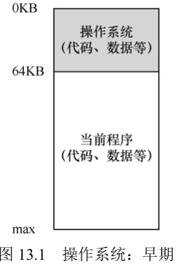
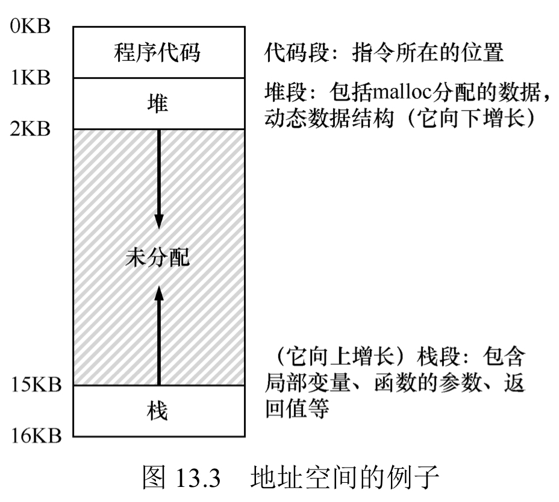
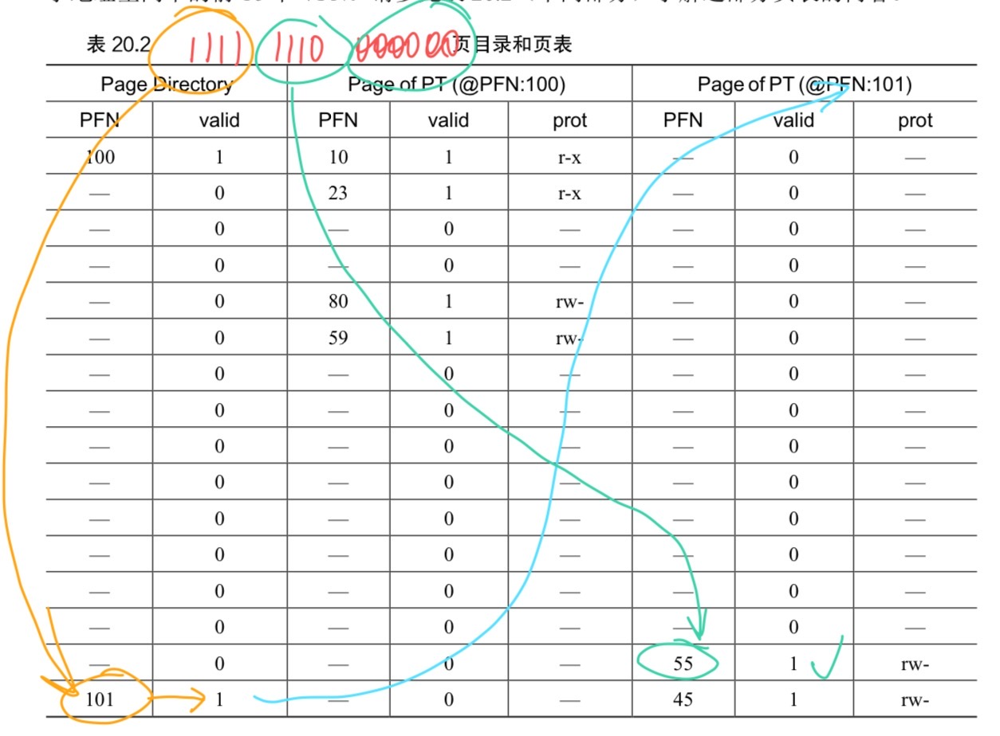
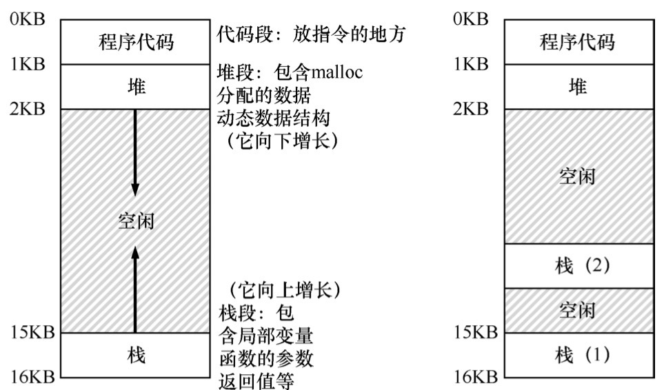

# OS笔记
### Chap4.进程
1.进程：一系列的机器状态，包括访问的内存/PC/栈指针/帧指针/代码
2.进程的创建：下载代码和静态数据，分配内存（栈/堆）
3.进程的状态：运行/就绪/堵塞（常见于：IO）
 

### Chap5.进程API
1.int fork()：创建新进程，父进程fork返回子进程PID，子进程返回0。可以根据返回值不同进行不同的操作。
2.int wait(int *status)：等待子进程完成，返回子进程PID。
3.int exec(char *file,int flags)：exec()从可执行程序加载代码和静态数据，覆写代码段，重新分配内存空间。它没有生成新进程，并且只要运行成功就不会再返回。
 

### Chap6.机制：受限直接执行
1.受限操作：用户模式/内核模式，程序通过执行特殊的trap指令进行系统调用。内核设置trap table告诉trap时要怎么做。
2.切换进程：协作方式下OS等待程序进行系统调用；非协作方式下OS通过时钟中断实现，但要注意保存中断时的状态。
3.上下文切换：保存并恢复寄存器的值（栈）
 

### Chap7.进程调度
先做如下假设：
1.每个工作运行时间一样。
2.所有工作同时到达。
3.一旦开始，工作进行到完成。
4.所有工作只用CPU。
5.工作的运行时间已知。
衡量指标是 周转时间 = 完成时间 - 到达时间。

A花100s,B花30s,C花20s
抛弃假设2，先采用FIFO策略（先进先出）：A先到会导致后续等待时间长
抛弃假设1，最短任务优先（SJF）：未解决上面的问题
抛弃假设3，允许中断和切换进程，最短完成时间优先（STCF）：即使A已经开始了，但是B/C进来后会切花执行B/C

新衡量指标：响应时间 = 首次运行 - 到达时间

改变STCF的不佳表现：轮换（Round-Robin），每个时间片（周期的倍数）都切换进程执行。
抛弃假设4，我们考虑IO，要尽量调度，达到CPU使用时间上的重叠。
 

### Chap8.多级反馈队列（MLFQ）
基本点：多个独立队列，每个队列不同优先级，优先级高的先执行。
规则(1)：P(A)>P(B)，A先执行
规则(2)：P(A)=P(B)，轮换执行
规则(3)：工作进入系统时，给予最高优先级 （所有工作都先默认为短工作）
规则(4)：一旦某个工作用完了时间配额，就降低优先级 （防止长时间占用，解决IO问题）
规则(5)：每经过一段时间，所有工作重新进入最高优先级 （防止不被执行）
 

### Chap9.比例份额
1.基本点：利用彩票机制来决定运行哪一个，给A分配400张，B100张；抽到谁的号码就运行谁。
2.彩票转让和彩票通胀。
3.利用步长调度减小不确定性：A,B,C各有100/50/250张彩票，步长取100/200/40。一开始行程都为0，运行A，A行程+100；接着B，行程+200；C，行程+40；之后仍选择最少行程的运行。这样会保证彩票多的运行次数更多
 

### Chap13.抽象：进程空间
1.早期系统：操作系统即一组函数，没什么抽象

    

2.多道程序和时分共享

3.地址空间
(1)地址空间：运行的程序看到的系统内存；地址空间包含：程序的代码、栈（保存调用信息，分配空间，传递参数和返回值）、堆（管理动态分配的、用户管理的内存）
(2)如下图例，如果某个进程在这个虚拟地址的0地址执行操作，操作系统需要保证加载到实际上的物理地址。

    

4.目标：透明、效率、保护
 

### Chap14.内存操作API
1.内存类型：栈内存和堆内存。栈内存申请很容易；堆内存的申请和释放都需要程序员显式完成，但可以长期存在。
2.malloc调用：
void *malloc(size_t size);
例：double *d = (double *) malloc(sizeof(double));
3.free()
4.需要注意的错误：
(1)忘记分配内存
(2)没有分配足够内存
(3)忘记初始化分配的内存
(4)忘记释放内存
(5)在用完之前释放内存
(6)反复释放内存
(7)错误调用free()

### Chap15.机制：地址转换
$physical \;\;address=virtual\;\;address\;+\;base$
基址和界限寄存器(base and bounds register)
内存管理单元(Memory Mangagement Unit，MMU)

    

 

### Chap16.分段
#### 16.1分段的引入
1.问题：为了支持大地址空间，避免空间的浪费
2.解决：分段(segmentation)。在MMU中引入不止一个基址和界限寄存器对，而是给地址空间内的每个逻辑段(segment)一对。一个段只是地址空间里的一个连续定长的区域：代码、栈和堆。

#### 16.2引用哪个段
1.显式方式：虚拟地址的头几位标识不同的段（3个段取俩位）；如虚拟地址4200：01 000001101000，01表示堆地址，后面12位表示迁移，我们只需要考察4200是否小于界限。
2.隐式方式：通过地址产生的方式来确实段。
3.共享：通过设定保护位

    

4.操作系统需要分段保存和恢复寄存器，需要管理物理内存的空闲空间。可以通过紧凑管理和空闲列表管理算法。

 

### Chap17.空闲空间管理
1.假设：只考虑外部碎片；内存一旦被分配不能被重定位；分配程序管理的是连续的一块字节区域
2.空闲列表：节点包含大小和节点位置
3.基本策略：
(1)最优匹配：遍历整个空闲列表，找到和请求大小一样或更大的空闲块；然后返回这组候选者中最小的一块。
(2)最差匹配：与最优匹配相反，尝试找最大的空闲块。
(3)首次匹配：找到第一个足够大的块。
(4)下次匹配：也是找到第一个足够大的块，但是维护一个指针指向上一次查找结束的位置。
4.其他方式
(1)分离空闲列表：用独立的列表管理经常申请的一种或几种大小的内存空间。
(2)伙伴系统：空闲空间一直二分，直到刚好可以(满足且最小)满足请求的大小

### Chap18.分页：介绍
1.将空间分割成固定大小的单元；操作系统通常为每个进程保存一个数据结构，即页表。页表用于为地址空间的每个虚拟页面保存地址转换，知道每个页在物理内存中的位置。
2.例子：
如小的地址空间共64字节，（即需要6位二进制），将虚拟地址表示为：Va5 Va4 Va3 Va2 Va1 Va0；我们如果将64字节分为4页，则Va5和Va4是虚拟页面号，即VPN，后4位为页内偏移。之后我们再通过页表找到虚拟页1对应的物理页面。
3.页表的结构：
通过VPN找到页表项（PTE），以便找到物理帧号（PFN）。PTE包括了PFN，有效位/保护位/存在位/脏位/参考位。
4.PTE的计算：
$VPN=(VirtualAddress\;\&\;VPN\_MASK) >> SHIFT$
$PTEAddr = PageTableBaseRegister + (VPN * sizeof(PTE))$
在上面例子中，VPN_MASK设定为0x30（取出高位），SHIFT取为4（偏移量的位数） 
 

### Chap19.分页：快速地址转换(TLB)
1.TLB的基本算法：
(1)从虚拟地址中取页号VPN
(2)检查TLB是否有该VPN的转换映射
(3)如果TLB命中，取出页帧号PFN，与虚拟地址中的偏移量组成物理地址PA；如果不命中，更新TLB    （类似Cache的机制）
2.TLB的内容：
(1)TLB是全相联的，一条地址映射可能存在TLB中的任意位置，硬件会并行地查找TLB。
(2)一条TLB内容为：VPN | PFN | 其他位
(3)上下文切换时的问题：
假设都不处理，可能在页表中，可能存在一样地VPN
解决1：在上下文切换时清空TLB，但是有开销
解决2：添加地址空间标识符，ASID，通常比PID位数少
3.TLB替换策略：如 LRU, random
 

### Chap20.分页：较小的表
1.问题：页表太大，消耗的内存太多。
2.简单解决：使用更大的页，导致页内的浪费(内部碎片)。
3.混合方法：分页和分段：
(1)如32位，页面4KB，如下：Seg(2位)+VPN(18位)+Offset(12位)
(2)TLB未命中时，找到页表项地址为：Base[Seg]+(VPN*sizeof(PTE))
4.多级页表：
(1)将页表分为页大小的单元。如果整页的页表项(PTE)无效，完全不分配该页的页表、使用页目录追踪页是否有效。
(2)在简单的二级页表中，页目录由多个页目录项PDE组成。PDE至少拥有有效位和页帧号；如果有效位为1，意味着该PDE指向的页表中至少有一页是有效的。
(3)多级页表是时间-空间折中的例子；复杂性也更高。
5.多级页表的例子：
比如16KB(14位的空间)，1页大小为6位，最前面4位为页目录索引，中间4位为页表索引。
如下例子：1111 1110 000000，先找到页目录索引为15的项，发现有效之后，找它对应的PFN(101)，再找到101中索引为1110(14)的页。得到PFN为55，所以最后的物理地址为55 << 6 + Offset(0)。

    

 

### Chap21.超越物理内存：机制
1.问题：操作系统如何利用大而慢的设备，透明地提供巨大虚拟地址空间的假象。
2.在硬盘上开辟一部分空间用于物理页的移入和移出，即交换空间。有的进程可能只有一部分有效页在内存中，剩下的在交换空间中。
3.需要一个存在位，判断是否在内存中。访问不在物理内存中的页是页错误。
4.什么时候交换页?设置高水位线HW和低水位线LW；当有少于LW个页可用，会释放内存，直到余HW个。

### Chap22.超越物理内存：策略
1.计算平均内存访问时间：$$AMAT=(P_{Hit}\cdot T_M) + (P_{Miss}\cdot T_D)$$
即考虑访问内存和磁盘的概率和开销。
2.最优替换策略：是理想情况
3.FIFO
4.Random
5.LRU
6.CLOCK
7.可以考虑脏页

### Chap26.并发：介绍
1.线程：
(1)与进程相比，上下文切换的地址空间保持不变，不需要切换页表。
(2)与进程相比，每个线程都有一个栈，但是code和推是一样的。

    

2.线程的创建：库$<pthread.h>$
pthread_t p; （线程变量
rc = pthread_create(&p1,NULL,mythread,"A") （创建，mythread是个函数，打印其后的值
rc = pthread_join(p1,NUNLL)  （等待线程完成
线程的执行顺序不只有唯一的可能
 
3.原子性愿望
(1)临界区：访问共享资源的代码
(2)竞态条件：都试图更新
(3)不确定性：输出因运行而异

### Chap27.插叙：线程API
1.创建：pthread_create

    参数1: pthread_t* thread
    参数2: const pthread_attr_t* attr,指定属性(大多时候为NULL)
    参数3: void* (*start_routine)(void*) 函数指针
    参数4: void* arg,给执行函数的参数
2.线程完成：pthread_join

    参数1: pthread_t* thread
    参数2: void* arg,指向希望得到的返回值
3.锁：通过锁提供互斥进入临界区的函数

    int pthread_mutex_lock(pthread_mutex_t *mutex)
    int pthread_mutex_unlock(pthread_mutex_t *mutex)
    int pthread_mutex_trylock(pthread_mutex_t *mutex)
    int pthread_mutex_timedlock(pthread_mutex_t *mutex,struct timespec *abs_timeout)
初始化-1 pthread_mutex_t lock = PTHREAD_MUTEX_INITIALIZER
初始化-2 int rc = pthread_mutex_init(&lock,NULL)

4.条件变量：

    (1)int pthread_cond_wait(pthread_cond_t *cond,pthread_mutex_t *mutex)
    使调用线程进入休眠状态，等待其他线程发出信号。
    (2)int pthread_cond_signal(pthread_cond_t *cond)
    发出信号，唤醒线程
 
### Chap28-锁
1.评价锁：
提供互斥、公平性、性能
2.通过控制中断实现锁：
(1)取消中断，不费力
(2)可能独占CPU,不支持多处理器,中断丢失
3.实现自旋锁：
(1)ldstub,
(2)一直自旋，一直检查变量,
(3)单CPU性能差，多CPU还不错
4.原语：

    比较并交换：CompareAndSwap
    链接加载和条件式存储
    获取并增加

5.自旋过多，可以在将自旋时放弃CPU
(1)如使用yield放弃CPU
(2)使用队列

### Chap29.基于锁的并发数据结构

### Chap30.条件变量
condition不满足，就进入等待(wait)队列，唤醒可以signal

### Chap31.信号量
sem_t ， sem_init ， sem_wait ， sem_post
1 0 -1 

